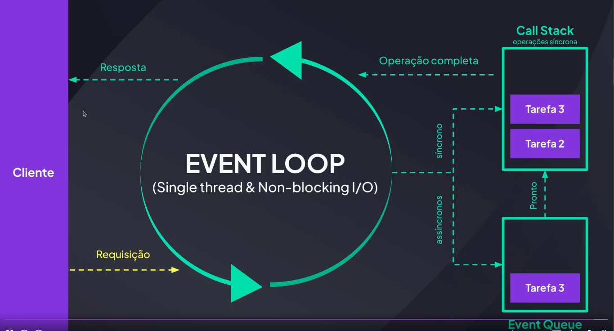

Como funciona o node?

Conceitos e Características do Node:
 1 - Single Thread
 2 - No Block I/O
 3 - Call Stack
 4 - Event Loop

 1 - O node é Single Thread, ou seja, existe uma única thread para executar o código javascript.
Esse única thread é responsável por lidar com todas as requisições, executar funções e gerenciar operações de I/O(input e output).

 2 - Pode se pensar que por ser uma única thread para executara eficiência pode cair ou algo assim, porém isso se relaciona com outra característica do Node, que é ele não é block I/O, ou seja, ele não bloqueia outras tarefas, em vez disso, ele delega essas operações e continua processando outras tarefas.

 3 - Call Stack é a pilha de tarefas que o Node precisa executar, como funcionamento padrão de Pilha, ele executa a tarefa no topo da Pilha e quando termina de executar ele remove ela da Pilha e executa a próxima que está no topo.

 4 - É um organizador que monitora a Call Stack e se ela estiver vazia ele pega a próxima tarefa da fila de eventos(event queue) e adiciona na Pilha.

 